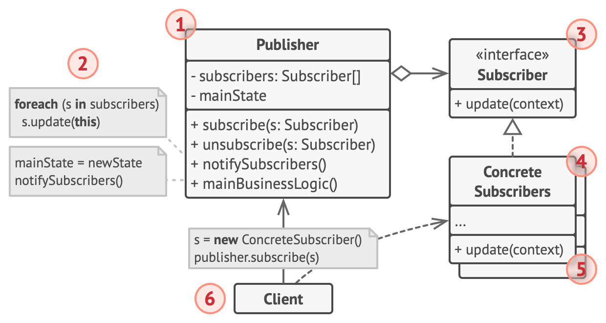

# Observer Pattern

## Behavioral Type  

### Use cases:
this pattern is used when we want to notify 

# Classes
- Publisher - class that have state that when its change other concreteobserver class will notify
- ConcreteSubscriber - classes that registered in Publisher and will notify the changes of its state 
- ConcreteState - class that take action on request diffrently from another concretestate class

# Interfaces
- Subscriber - contains update method

# Visual Diagram

image by [refactoring guru](https://refactoring.guru)